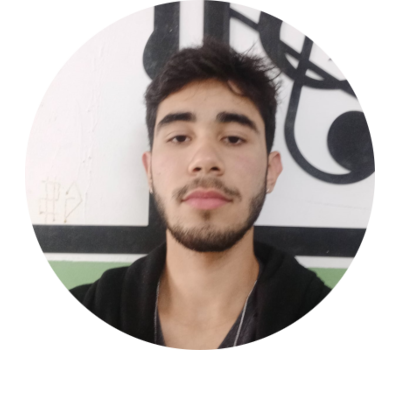

<h1 >Nostalgic-World</h1>

Um site de streaming de filmes, séries e desenhos antigos idealizado e produzido pela equipe SpeedTech como seu primeiro projeto.

#

## Nossa Equipe
 

    
    
    
    
    
    

#

<h2>Linguagens e Ferramentas utilizadas</h2>
 

    
    
    

